# Sedric Twilio Flex Integration

## Introduction
This integration is based on the following [Twilio project](https://github.com/twilio-professional-services/flex-dual-channel-recording) which describes
the various options to integrate Twilio with external systems. 

The architecture consists of 3 components:
1. Flex Plugin.
1. Flex Serverless Function. 
1. Sedric Public API.

The *Flex plugin* is enabled in the web browser and it calls the *Flex Serverless Function* as soon as a call is completed. The function in turn registers a webhook on a *recording completed event* to send an API call to sedric public API.

## Requirements
* Twilio Flex only supports Google Chrome browsers.
* Customers should remove extensions that interfe with the execution of the function (e.g. add blockers)
* You should have the latest version of [node](https://nodejs.org/en/download/) installed. 
## Account Setup

1. Generate a Secondary Auth key. Also note the `Account SID`. 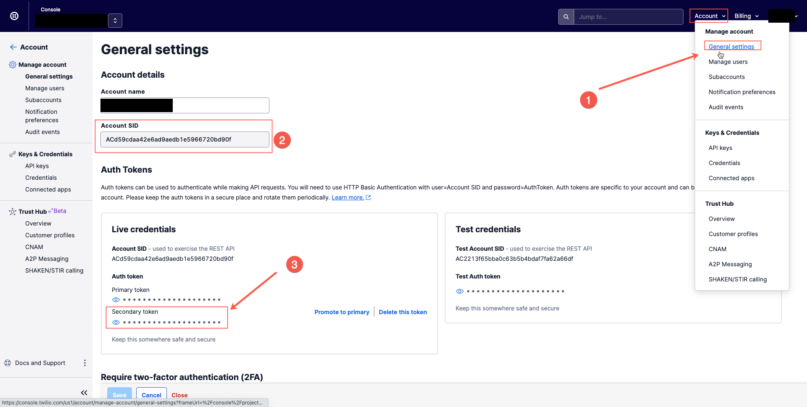

1. Require [authetication](https://support.twilio.com/hc/en-us/articles/223183748-Prevent-Unauthorized-Access-to-Your-Media-with-HTTP-Basic-Auth) for every request for a media asset. This will prevent your recordings to be publicly available. 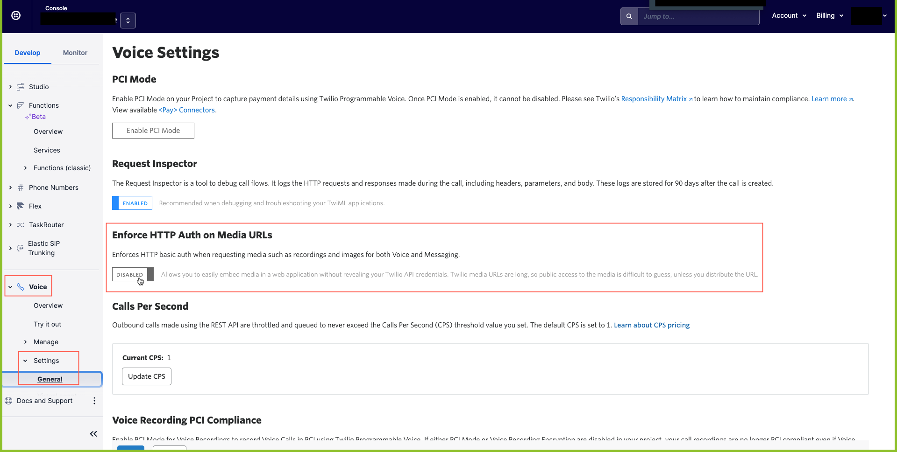
## Installation

1. Create an `.env` file containing [the account configuration](https://www.twilio.com/docs/twilio-cli/general-usage#want-to-use-environment-variables-instead-of-creating-a-profile) and `source` it.

1. Install the **Twilio CLI** and additional **plugins**.
    1. [Twilio CLI](https://www.twilio.com/docs/twilio-cli/quickstart)
    1. [Serverless Toolkit plugin for Twilio CLI](https://www.twilio.com/docs/labs/serverless-toolkit/getting-started#install-the-twilio-serverless-toolkit)
    1. [Flex CLI Plugin](https://www.twilio.com/docs/flex/developer/plugins/cli/install)
    1. [Twilio Serverless plugin](https://www.twilio.com/docs/twilio-cli/plugins#available-plugins)
  
1. Deploy the **serverless function**.
    1. Navigate to the `dual-channel-rec-serverless` folder in this repository.
    2. Run `npm i` to install all node.js package dependencies
    3. From your terminal again, run `twilio serverless:deploy` to deploy the functions to your Twilio Flex project.
    4. Once the deployment is completed, note the `Domain` in the Deployment Details shown in the terminal. This will be used in the Flex Plugin `.env` environment variable file.

1. Deploy the **Flex plugin**.
    1. Navigate to the `plugin-dual-channel-recording` folder in this repository.
    2. Run `npm i` to install all node.js package dependencies
    3. In the root directory populate the `.env` file `REACT_APP_SERVERLESS_DOMAIN=` variable with the Twilio Serverless Domain noted from the Twilio Function deployment.
    4. Run the following command to start the deployment `twilio flex:plugins:deploy --major --changelog "Notes for this version" --description "Functionality of the plugin"`
    5. Run `twilio flex:plugins:release --plugin plugin-dual-channel-recording@1.0.0 --name "Autogenerated Release 1633088235953" --description "The description of this Flex Plugin Configuration."` to enable this plugin on your Flex application. 

## Validation

1. Validate that existence of the **serverless function**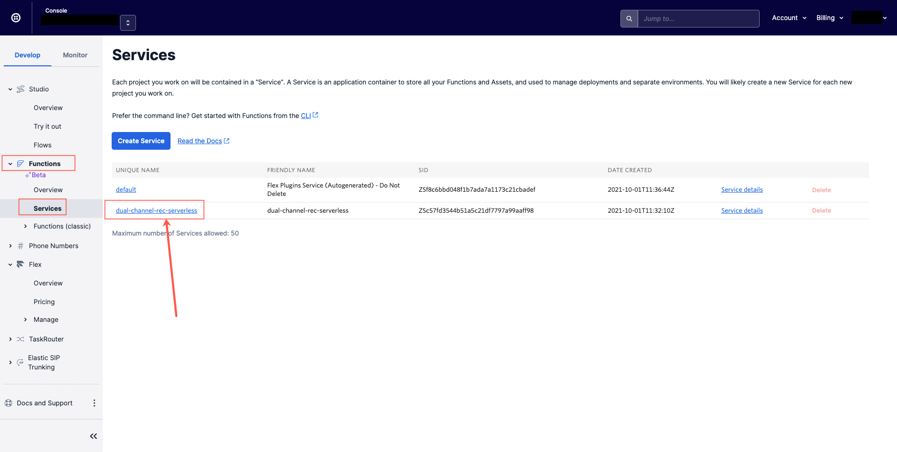

2. Validate the existence of the **plugin** 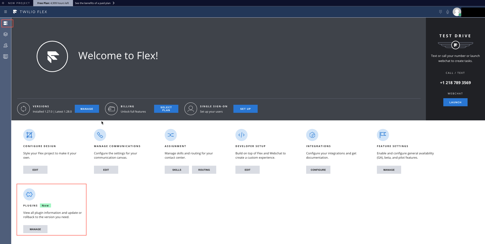 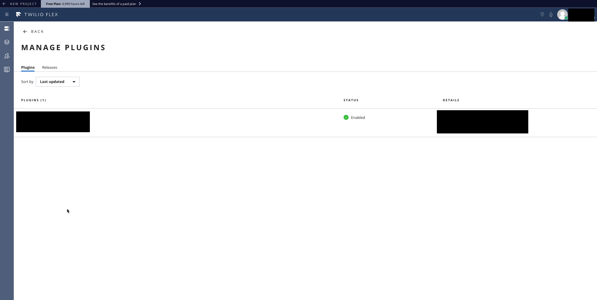

## Debug

1. Login to [Twilio Console](https://console.twilio.com) and enable the dialpad Functionality. 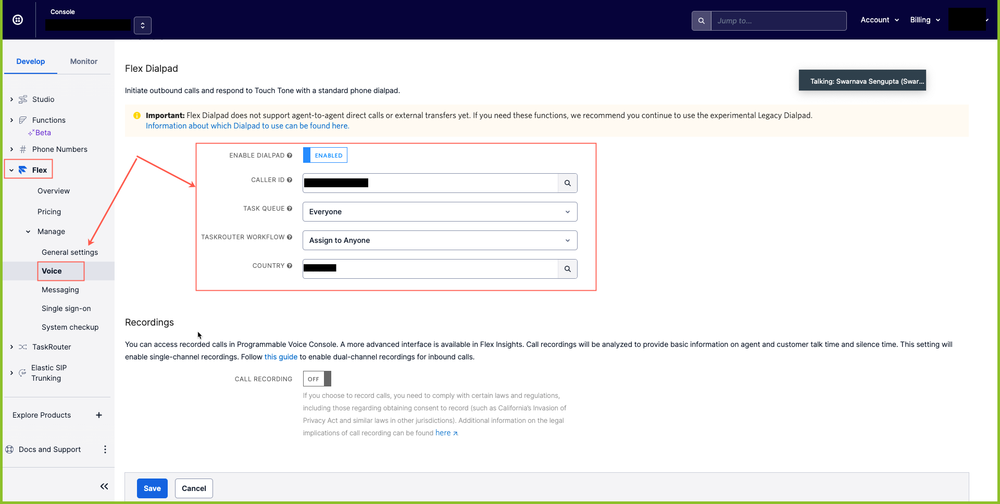

1. Login to [Twilio Flex](https://flex.twilio.com/) as an admin, open the developer tools and go to the *network* tab. 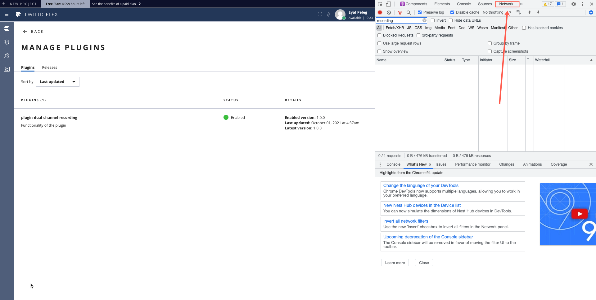

1. Make yourself available. 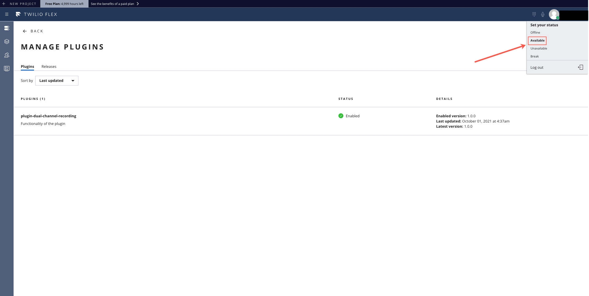

1. Execute a call and hang up. 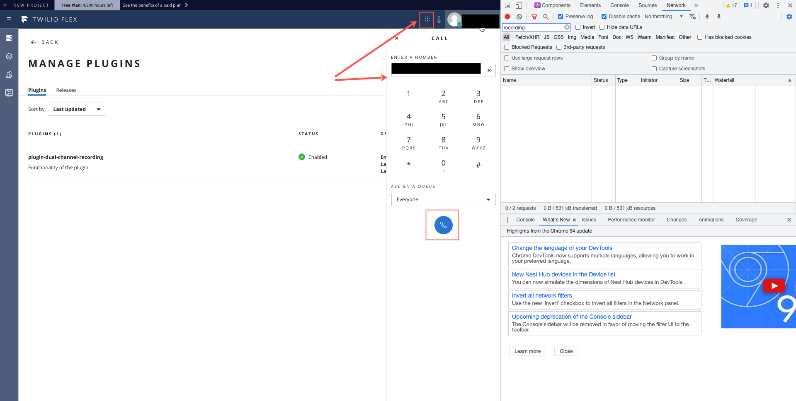

1. You should be able to see and examine the execution of the plugin. 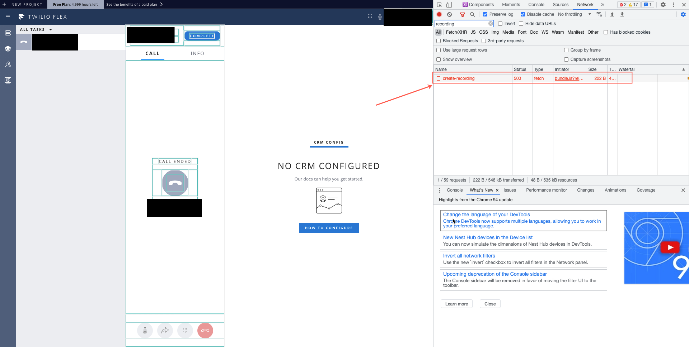

1. Go to the Twilio Console and validated that the recording file exists. 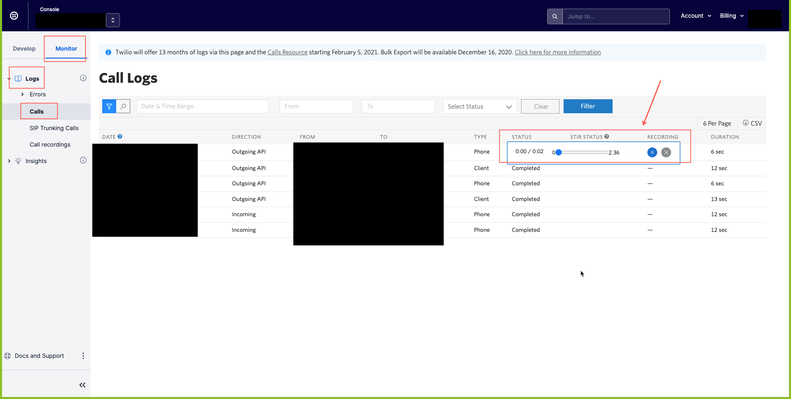

## Additional Information

1. Recording comes with no additional costs.
2. There is also an [encryption option](https://www.twilio.com/docs/voice/tutorials/voice-recording-encryption) which comes with additional costs of $.015 for each encrypted recording minute.